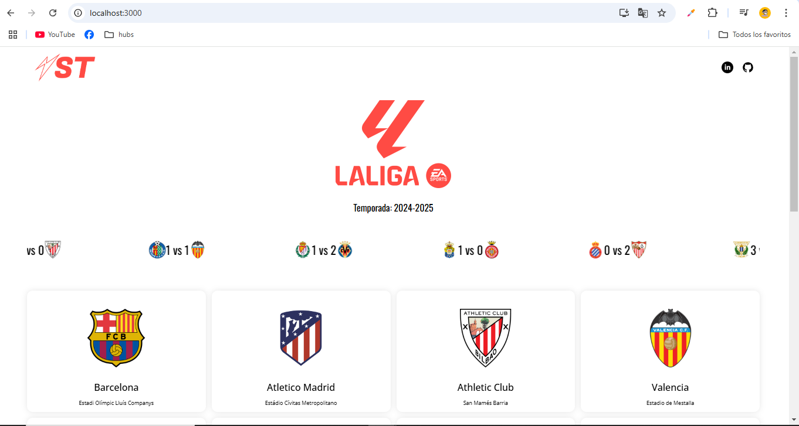
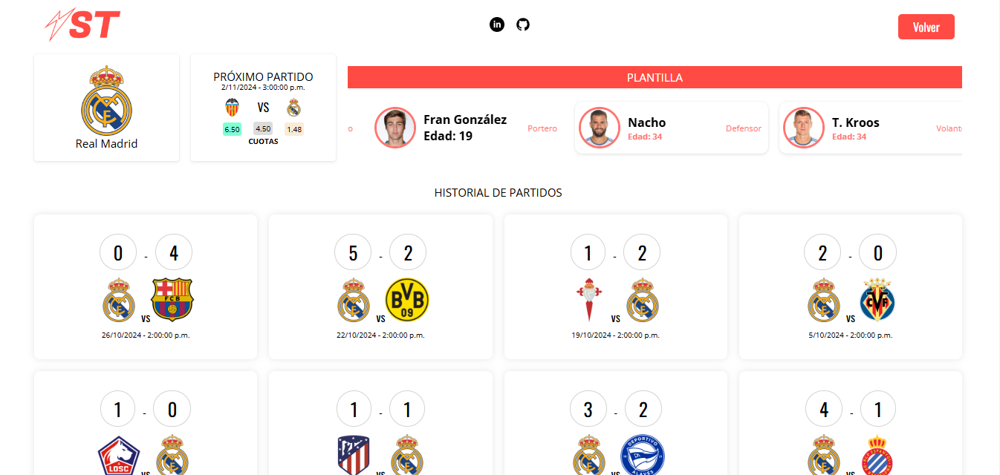

# Proyecto: **La Liga / futbol-app**

## Descripción
**La Liga / futbol-app** es una aplicación web interactiva que permite a los usuarios consultar estadisticas en tiempo real de la Liga Española de Futbol, en esta versión inicial se puede consultar cada equipo de la liga, sus últimos resultados y plantilla. a futuro este proyecto esta pensado para convertirse en una app de apuestas deportivas. 
Diseñada con un enfoque en la experiencia del usuario, esta aplicación ofrece una interfaz intuitiva, simple y atractiva.

## Capturas de Pantalla



## Características
- **Interfaz de Usuario Responsiva**: Se adapta a diferentes tamaños de pantalla.
- **Integración con API**: Consume datos de API-FOOTBALL para ofrecer contenido actualizado en vivo.

## Tecnologías Utilizadas
- **React**: Para construir la interfaz de usuario.
- **CSS3**: Para el diseño y estilo de la aplicación.
- **Prime Flex**: Estilos y maquetación.
- **React-Loading-Skeleton**: Manejo de estados Loading.
- **React Spring**: Animaciones y efectos.

### Instalación y Uso
Para instalar y ejecutar la aplicación, sigue estos pasos:

1. **Clona el repositorio:**
   ```bash
   git clone https://github.com/TU_USUARIO/la-liga.git
   cd la-liga
   npm install
   npm start

## Contribuciones
¡Las contribuciones son bienvenidas! Si deseas contribuir, por favor sigue estos pasos:
1. **FORK**: Haz un fork del repositorio.
2. **Nueva Rama**: Crea una nueva rama (`git checkout -b feature/nueva-caracteristica`).
3. **Commit**: Realiza tus cambios y haz un commit (`git commit -m 'Agregada nueva característica'`).
4. **Pull**: Envía un pull request.

## Estado del Proyecto
Este proyecto está actualmente en desarrollo. Las siguientes características están en planificación:

- Integración de un sistema de apuestas.
- Mejora de la interfaz de usuario.
- Agregar más estadísticas en tiempo real.

## Contacto
Si tienes alguna pregunta o sugerencia, no dudes en contactarme en el correo electronico de mi perfil.

## Licencia
Este proyecto está bajo la Licencia MIT - consulta el archivo LICENSE para más detalles.